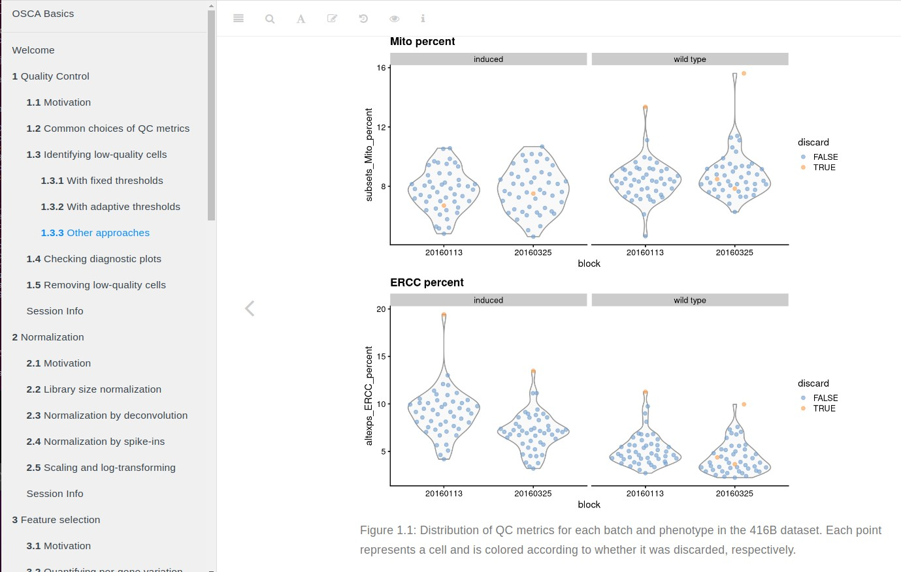

# BiocOV: a package with a brief overview of Bioconductor concepts

This package includes vignettes, functions and illustrative data on the
following topics

- MultiAssayExperiment representation of The Cancer Genome Atlas, with
illustration of survival analysis

- Genome representation with Biostrings, BSgenome, and TxDb packages

- Single-cell transcriptomics with scRNAseq and scater, including
exploration of the Human Cell Atlas and Cell Ontology

Other topics should be proposed and added over time.
