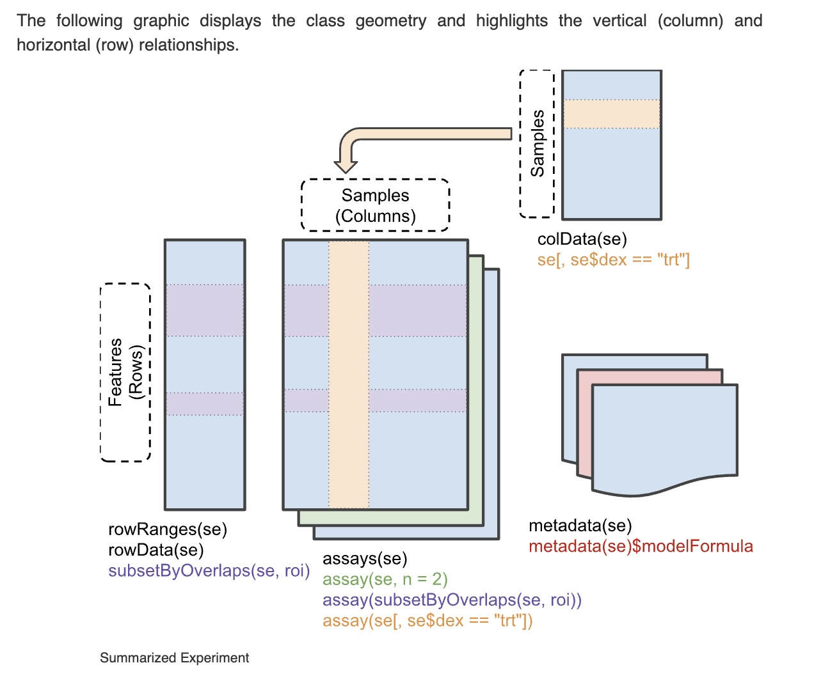

```{r setup,echo=FALSE,message=FALSE}
library(AnnotationDbi)
library(org.Hs.eg.db)
library(BiocStyle)
library(dplyr)
library(BiocOV)
library(TnT)
library(DT)
```

# Genomic annotation of organisms

Institutionally curated data on model organisms
are collected in packages with names starting with `org.`.


```{r lkorg1,message=FALSE}
library(org.Hs.eg.db)
org.Hs.eg.db
columns(org.Hs.eg.db)
```

Using `r Biocpkg("AnnotationDbi")` we can produce data.frames
with annotation.  We'll use the gene titin (TTN) to illustrate
acquisition of Gene Ontology annotations.

```{r lk2}
library(AnnotationDbi)
ttnanno = AnnotationDbi::select(org.Hs.eg.db, keys="TTN", keytype="SYMBOL",
  columns=c("ENTREZID", "ENSEMBL", "GENENAME", "GO"))
head(ttnanno)
```

Using `r Biocpkg("GO.db")` through a helper function `decode_gotags`
defined in `BiocOV`, we can learn aspects of gene function.
Here we limit annotations to those identified through "traceable author statements", "TAS".

```{r lk3, message=FALSE}
library(dplyr)
library(BiocOV)
ttnanno |> dplyr::filter(EVIDENCE=="TAS") |> decode_gotags()
```

# Genomic sequence and genomic coordinates

The full sequences of model organisms are available using
`r Biocpkg("Biostrings")` and `r Biocpkg("BSgenome")`
resources.

```{r lkn,message=FALSE}
library(BSgenome.Hsapiens.UCSC.hg19)
Hsapiens
substr(Hsapiens$chr1, 1e6, 2e6-1)
```

## UCSC gene coordinates

Gene models are available in the TxDb series of packages.

```{r gettx,message=FALSE}
library(TxDb.Hsapiens.UCSC.hg19.knownGene)
txdb = TxDb.Hsapiens.UCSC.hg19.knownGene
txdb
g = genes(txdb)
g
```

The `genes` function returns a GenomicRanges instance.  We
can add gene symbols using AnnotationDbi and org.Hs.eg.db.

```{r doadd}
smap = AnnotationDbi::select(org.Hs.eg.db, 
   keys=g$gene_id, keytype="ENTREZID", columns="SYMBOL") 
g$gene_symbol = smap$SYMBOL
head(g)
```

The genomic coordinates for genes of interest
can now be retrieved from `g`.

```{r getggg}
ttnco = g[ which(g$gene_symbol == "TTN") ]
ttnco
```

And the coding sequence can be extracted from `Hsapiens`.

```{r getsq}
substr(Hsapiens$chr2, start(ttnco), end(ttnco))
```

## Ensemble gene coordinates

The EnsDb. packages provide richer
annotation through the genes method.

```{r usee}
library(EnsDb.Hsapiens.v75) # same as hg19
genes(EnsDb.Hsapiens.v75)
```

# Interactive visualization of genes

The `r Biocpkg("TnT")` includes javascript facilities for
interactively visualizing genomes and data collected in
genomic coordinates.  We'll show the context of TTN.
If you have a click-wheel it can be used to zoom in and out,
and to pan across the genome.

```{r trytnt,message=FALSE}
library(TnT)
```
```{r dopl}
gene = genes(EnsDb.Hsapiens.v75)
ensGeneTrack <- TnT::FeatureTrack(gene, tooltip = as.data.frame(gene),
                       names = paste(gene$symbol, " (", gene$gene_biotype, ")", sep = ""),
                       color = TnT::mapcol(gene$gene_biotype, palette.fun = grDevices::rainbow))
inir = GRanges("2", IRanges(179380000, 179490000))
TnTGenome(ensGeneTrack, view.range = inir)
```

# Exercises

## Tabulating annotation for a region of interest

The following function obtains a data.frame with information
about a 10Mb segment of chromosome 2.
```{r lkg}
ginfo = function(chr="2", start=170e6, end=180e6) {
  g = ensembldb::genes(EnsDb.Hsapiens.v75)
  targ = GenomicRanges::GRanges(chr, IRanges::IRanges(start, end))
  as.data.frame(IRanges::subsetByOverlaps(g, targ))
}
tab = ginfo()
```

The average number of protein-coding genes per megabase in this region can
be obtained as
```{r lkav}
dist = (max(tab$end) - min(tab$start))/1e6
npc = sum(tab$gene_biotype == "protein_coding")
npc/dist
```

What is the average number of protein-coding genes per megabase for all of chromosome 2?

- You will run the `ginfo` function with different arguments.
- The lengths of chromosomes can be obtained via `seqinfo(Hsapiens)`.

## Exploring annotation on cellular localization of gene activity

Here is a helper function for tabulating annotation for a gene identified by
symbol.
```{r dohelp}
myanno = function(gene_symbol="BRCA2")
    AnnotationDbi::select(org.Hs.eg.db, keys=gene_symbol, keytype="SYMBOL",
       columns=c("ENTREZID", "ENSEMBL", "GENENAME", "GO"))
dim(myanno())
```

We use the CC (cellular component) subontology of GO to see what components
BRCA2 has been annotated to:

```{r chkc, message=FALSE}
library(DT)
brtab = myanno("BRCA2") |> dplyr::filter(ONTOLOGY=="CC") |> decode_gotags()
datatable(brtab)
```

Note that the same component can be annotated on the basis of different [evidence codes](http://geneontology.org/docs/guide-go-evidence-codes/).

Find the cellular components annotated for gene ORMDL3, and for genes of your choice.

# Coordinated data structures for multisample genomics

## SummarizedExperiment

Relative to typical volumes and arrangements of data in scientific studies,
genomic studies are distinguished by very large numbers of features
collected per sample.  Measurements often fall into two classes.  
- Matrix-like structures store
the collection of molecular assay outputs, involving
one or more digital measurements per genomic feature.  This component
is referred to as "Assay".
- In addition to the assay outputs, a data table is needed to store
information on sample characteristics.  This component is referred
to as "colData".

Additional metadata on assay features and on the experiment as a whole
must be accommodated, "tightly bound" with all the other information so
that crucial information about context and interpretation do not
scatter away.

A schematic view of the "SummarizedExperiment" that collects these
information components is here:



An example can be obtained using ExperimentHub.

```{r doex,message=FALSE}
library(ExperimentHub)
eh = ExperimentHub()
tnorm = eh[["EH1044"]]
tnorm
```

We compute the sequencing depth per sample
using 
```{r dode}
dep = colSums(assay(tnorm))
hist(dep, xlab="sum of counts per sample")
```

The tumor type with smallest value of depth is:
```{r domin}
tnorm$type[ which.min(dep) ]
```

Exercise: Three samples have depth values exceeding
120,000,000.  What type(s) of tumors are they
derived from?

## SingleCellExperiment

The explosion of interest in single-cell RNA-seq has inspired
the extension of the SummarizedExperiment design to
simplify common tasks employed with single-cell studies.

A schematic of the `r Biocpkg("SingleCellExperiment")` class
is:


### Predicting cell type using reference expression data

These illustrations are taken from the introduction to
the [SingleR](http://bioconductor.org/books/release/SingleRBook/introduction.html) book.

The "Human Primary Cell Atlas" records expression patterns
for sorted cells.  The cell type distributions are
tabulated here, drilling down on "T cells" for subtypes.
```{r lklabs,message=FALSE}
library(celldex)
ref.data <- HumanPrimaryCellAtlasData(ensembl=TRUE)
ref.data
table(ref.data$label.main)
table(ref.data$label.fine[ref.data$label.main=="T_cells"])
```

Unlabeled single-cell expression patterns were assayed on 4000 PBMCs
using the TENx platform.  We acquire the SingleCellExperiment:

```{r getpb,message=FALSE}
library(TENxPBMCData)
new.data <- TENxPBMCData("pbmc4k")
```

The unlabeled cells are compared to reference and
labels are inferred using the method in

```
     Aran D, Looney AP, Liu L et al. (2019). Reference-based analysis
     of lung single-cell sequencing reveals a transitional profibrotic
     macrophage. _Nat. Immunology_ 20, 163–172.
```

```{r dopred,message=FALSE}
library(SingleR)
predictions <- SingleR(test=new.data, assay.type.test=1, 
    ref=ref.data, labels=ref.data$label.main)
table(predictions$labels)
library(scater)
nn = logNormCounts(new.data)
nn = runPCA(nn)
nn$type = predictions$labels
plotPCA(nn,colour_by="type")
```

## MultiAssayExperiment


- The colData provides data about the patients, cell lines, or other 
biological units, with one row per unit and one column per variable. 
- The experiments are a list of assay datasets of arbitrary class, with 
one column per observation. 
- The sampleMap links a single table of patient 
data (colData) to a list of experiments via a simple but powerful 
table of experiment:patient edges (relationships), that can be created automatically in simple 
cases or in a spreadsheet if assay-specific sample identifiers are used. sampleMap 
relates each column (observation) in the assays (experiments) to exactly one row 
(biological unit) in colData; however, one row of colData may map to 
zero, one, or more columns per assay, allowing for missing and replicate 
assays. Green stripes indicate a mapping of one subject to multiple observations 
across experiments.
